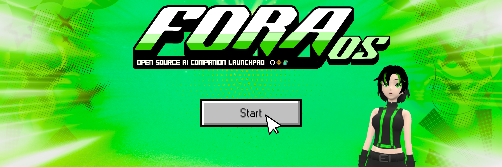

<div align="center">



# ✨ ForaOS ✨

### *Create Your Perfect AI Companion*

[](https://github.com/monarchoct/ForaOS)
[](https://github.com/monarchoct/ForaOS)
[](https://github.com/monarchoct/ForaOS/issues)
[](https://github.com/monarchoct/ForaOS/blob/main/LICENSE)

---

**🌟 A fully customizable Opensource AI companion Launchpad with 3D character animations, emotions, and voice interaction**  
**🎨 Deploy your own AI companion with your own model, animations, and personality**

---

</div>

## ✨ What Makes ForaOS Special?

<table>
<tr>
<td width="50%">

### 🧠 **Intelligent AI Core**
- **Advanced Emotion Engine** - Real emotional responses
- **Personality System** - Fully customizable traits
- **Memory Management** - Remembers your conversations
- **Autonomous Thinking** - AI acts independently
- **Context Awareness** - Understands what you're doing

</td>
<td width="50%">

### 🎨 **Stunning 3D Visualization**
- **Lifelike Animations** - Smooth idle and action movements
- **Dynamic Emotions** - Facial expressions change with mood
- **Voice Synthesis** - Natural speech with ElevenLabs
- **Custom Backgrounds** - Beautiful environments
- **Responsive Design** - Works on any device

</td>
</tr>
</table>

## 🚀 Key Features

<div align="center">

| 🎭 **Character System** | 🤖 **AI Intelligence** | 🎨 **Visual Experience** |
|:---:|:---:|:---:|
| 3D Model Support | OpenAI Integration | Dynamic Animations |
| Emotion Expressions | Personality Traits | Background Customization |
| Voice Synthesis | Memory Management | Mobile Responsive |
| Action Gestures | Autonomous Behavior | Screen Capture |

</div>

## 🎯 Quick Start

<div align="center">

```bash
# 1️⃣ Clone the repository
git clone https://github.com/monarchoct/ForaOS.git
cd ForaOS

# 2️⃣ Copy environment template
cp .env.example .env

# 3️⃣ Add your API keys to .env
# Edit .env file with your OpenAI and ElevenLabs keys

# 4️⃣ Start development server
npm install
npm run web-dev

# 5️⃣ Open in browser
# Navigate to http://localhost:5173
```

**🚀 Your AI companion will be ready in minutes!**

</div>

## 📋 Prerequisites

<div align="center">

| Requirement | Description | Optional |
|:---:|:---|:---:|
| 🤖 **3D Model** | GLB format character model | ❌ |
| 🔑 **OpenAI API** | For AI chat generation | ❌ |
| 🎤 **ElevenLabs** | For voice synthesis | ✅ |
| 🌐 **Web Hosting** | GitHub Pages, Vercel, etc. | ✅ |

</div>

## 🛠️ Setup Instructions

### 1. Clone the Repository

```bash
git clone https://github.com/yourusername/ForaOS.git
cd ForaOS
```

### 2. Install Dependencies

```bash
npm install
```

### 3. Configure API Keys

Create a `.env` file in the root directory:

```env
# Required
OPENAI_API_KEY=your_openai_api_key_here
OPENAI_MODEL=gpt-3.5-turbo
OPENAI_MAX_TOKENS=150
OPENAI_TEMPERATURE=0.8

# Optional
ELEVENLABS_API_KEY=your_elevenlabs_api_key_here
ELEVENLABS_BASE_URL=https://api.elevenlabs.io/v1

# Venice AI (Alternative to OpenAI)
VENICE_API_KEY=your_venice_token_here
VENICE_BASE_URL=https://api.venice.ai/api/v1
VENICE_MODEL=claude-3-5-sonnet
VENICE_CHARACTER_SLUG=your_character_slug

# Twitter API
TWITTER_API_KEY=your_twitter_api_key
TWITTER_API_SECRET=your_twitter_api_secret
TWITTER_ACCESS_TOKEN=your_twitter_access_token
TWITTER_ACCESS_TOKEN_SECRET=your_twitter_access_token_secret
TWITTER_BEARER_TOKEN=your_twitter_bearer_token

# Twitch API
TWITCH_CLIENT_ID=your_twitch_client_id
TWITCH_CLIENT_SECRET=your_twitch_client_secret
TWITCH_ACCESS_TOKEN=your_twitch_access_token
```

### 4. Configure Your Character

#### Add Your 3D Model
1. Place your character GLB file in the `models/` folder
2. Update `config/animation-config.json` to configure your model and background:
```json
{
  "model": {
    "description": "3D Character model configuration",
    "characterFile": "./models/your-character.glb",
    "backgroundFile": "./backgrounds/your-background.png",
    "defaultBackground": "your-background.png"
  }
}
```

#### Configure Animations
Edit `config/animation-config.json` to match your character's animations:

```json
{
  "animations": {
    "idle": {
      "animations": [
        "Your Idle Animation 1",
        "Your Idle Animation 2",
        "Your Idle Animation 3"
      ],
      "timeScale": 0.25
    },
    "actions": {
      "animations": [
        "Wave",
        "Nod",
        "Shake Head",
        "Thumbs Up"
      ],
      "maxLoops": 3,
      "timeScale": 0.2
    }
  }
}
```

#### Configure Shapekeys (Emotions)
Map your character's shapekeys for emotions in `config/animation-config.json`:

```json
{
  "shapekeys": {
    "emotions": {
      "shapekeys": {
        "happy": {
          "shapekey1": {
            "mesh": "face_01001",
            "shapekey": "mouth smile",
            "value": 1.0
          },
          "shapekey2": {
            "mesh": "brows_01001",
            "shapekey": "eyebrow up",
            "value": 1.0
          }
        }
      }
    }
  }
}
```

### 5. Customize Personality

Edit `config/personality.json` to define your AI's personality:

```json
{
  "name": "Your AI Name",
  "baseTraits": {
    "friendliness": 0.8,
    "humor": 0.6,
    "empathy": 0.9,
    "curiosity": 0.7
  },
  "customTraits": {
    "sarcasm": 0.3,
    "creativity": 0.8
  },
  "backgroundStory": "Your AI's backstory and personality description"
}
```

### 6. Start Development Server

```bash
npm run web-dev
```

### 7. Open in Browser
Navigate to `http://localhost:5173`

## 🎨 Customization Options

### Backgrounds
- Add background images to `backgrounds/` folder
- Set your preferred background with `backgroundFile` and `defaultBackground` in `config/animation-config.json`

### UI Theme
Customize colors and styling in `companion-config.json`:

```json
{
  "ui": {
    "theme": {
      "loadingScreen": {
        "backgroundColor": "#39FF14",
        "textColor": "#ffffff"
      },
      "settings": {
        "containerBackground": "rgba(30, 30, 30, 0.9)",
        "buttonBackground": "rgba(30, 30, 30, 0.9)"
      }
    }
  }
}
```

### Animation Settings
- Adjust idle animation speed with `timeScale`
- Configure action animation loops and fade durations
- Set emotion fade in/out timing

## 🎛️ Personality Configuration

### Base Traits
- **optimism**: How positive the AI is (0-1)
- **empathy**: Emotional sensitivity (0-1)
- **playfulness**: Fun-loving nature (0-1)
- **curiosity**: Interest in learning (0-1)
- **shyness**: Social confidence (0-1)
- **talkativeness**: How much the AI speaks (0-1)
- **energy**: Activity level (0-1)
- **formality**: Communication style (0-1)
- **intelligence**: Problem-solving ability (0-1)

### Emotions
Each emotion has:
- **intensity**: How strong the emotion is
- **blendshape**: 3D facial expression
- **voiceModifier**: Speech characteristics
- **animation**: Character movement

### Voice Settings
- **voiceId**: ElevenLabs voice ID
- **stability**: Voice consistency (0-1)
- **similarityBoost**: Voice similarity (0-1)
- **style**: Voice style (0-1)

## 🚀 Deployment

### GitHub Pages (Recommended)

1. Push your code to a GitHub repository
2. Go to Settings → Pages
3. Select "Deploy from a branch" → "main"
4. Your site will be available at `https://yourusername.github.io/repository-name`

### Netlify

1. Drag and drop your project folder to Netlify
2. Or connect your GitHub repository for automatic deployments

## 🏗️ Architecture

### HEART-CORE (AI Logic)
```
emotionEngine.js      - Emotional state management
thoughtManager.js     - Autonomous thinking
affinityManager.js    - Relationship tracking
speechPlanner.js      - Response generation
autonomousLoop.js     - Independent actions
attentionSystem.js    - User engagement
memoryManager.js      - Conversation history
socialOutputMgr.js    - Social media integration
moodDrift.js         - Passive mood changes
personality.js       - Trait management
```

### HEART-VIZ (Visualization)
```
renderer.js           - Three.js scene management
animationManager.js   - Character animations
blendshapeManager.js  - Facial expressions
microMovementMgr.js  - Subtle movements
voiceManager.js       - Text-to-speech
backgroundManager.js  - Dynamic backgrounds
```

### Input/Output
```
inputManager.js       - User input handling
ui-manager.js         - Interface management
config-manager.js     - Configuration loading
```

## 🎮 Usage

### Basic Interaction
1. Type messages in the chat input at the bottom
2. The AI will respond based on its personality and current mood
3. Watch the character's expressions and animations change
4. Use the control buttons for additional features

## 🔧 Troubleshooting

### Common Issues

**Character not loading:**
- Check that your GLB file is in the correct path
- Verify the file name matches `companion-config.json`
- Ensure the GLB file is not corrupted

**Animations not working:**
- Verify animation names match exactly (case-sensitive)
- Check that animations exist in your GLB file
- Review browser console for errors

**API errors:**
- Verify your API keys are correct in the `.env` file
- Check that you have sufficient API credits
- Ensure CORS is properly configured for your domain

**Shapekeys not working:**
- Verify mesh names match your model
- Check shapekey names are correct
- Ensure shapekeys exist in your model

### Debug Mode

Enable debug logging by opening browser console (F12) to see detailed information about:
- Animation loading
- API calls
- Error messages
- Configuration loading

## 📁 Project Structure

```
ForaOS/
├── config/
│   ├── companion-config.json    # Main configuration
│   ├── personality.json         # AI personality traits
│   ├── heart-state.json         # Runtime state
│   ├── memory.json              # Conversation memory
│   └── api-keys-template.json   # API keys template
├── models/                      # 3D character models
├── backgrounds/                 # Background images
├── icons/                       # UI icons
├── js/
│   ├── heart/                   # Core AI system
│   │   ├── core/               # AI logic components
│   │   ├── viz/                # Visualization components
│   │   ├── social/             # Social media integration
│   │   └── inputs/             # Input handling
│   ├── ui/                      # User interface
│   └── utils/                   # Utility functions
├── styles.css                   # Main stylesheet
├── index.html                   # Main HTML file
├── .env                         # Environment variables (create this)
└── env.example                  # Environment variables template
```

## 🔌 API Integration

### OpenAI (Required)
- Used for advanced response generation
- Configure in `.env` file with `OPENAI_API_KEY`

### ElevenLabs (Optional)
- Provides high-quality text-to-speech
- Falls back to browser TTS if not configured

### Venice AI (Alternative)
- Alternative to OpenAI
- Configure with `VENICE_API_KEY`

### Twitter (Optional)
- Posts autonomous thoughts publicly
- Requires Twitter API credentials

## 🤝 Contributing

1. Fork the repository
2. Create a feature branch: `git checkout -b feature-name`
3. Commit your changes: `git commit -m 'Add feature'`
4. Push to the branch: `git push origin feature-name`
5. Submit a pull request

## 📄 License

This project is licensed under the MIT License - see the LICENSE file for details.

## 🙏 Acknowledgments

- Three.js for 3D rendering
- OpenAI for AI chat capabilities
- ElevenLabs for voice synthesis
- The open-source community

## 📞 Support

<div align="center">

## 💬 **Need Help?**

| Platform | Link | Description |
|:---:|:---|:---|
| 🐛 **Issues** | [GitHub Issues](https://github.com/monarchoct/ForaOS/issues) | Report bugs and request features |
| 💬 **Discord** | [Join Discord](https://discord.gg/your-discord) | Get help from the community |
| 📖 **Wiki** | [Documentation](https://github.com/monarchoct/ForaOS/wiki) | Detailed guides and tutorials |

---

<<<<<<< HEAD
## 🌟 **Show Your Support**

If you love ForaOS, please give us a ⭐ **star** on GitHub!

<div align="center">

### 🎨 **Create Your Perfect AI Companion** ✨

**Happy building! Create your favorite AI character!** 🤖✨

[](https://github.com/monarchoct/ForaOS)
[](https://github.com/monarchoct/ForaOS)

</div>

</div>
=======
**Happy building! Create your favorite AI character! **
>>>>>>> 75a94736233b5b60a20905486a7be612b93d6ba9
